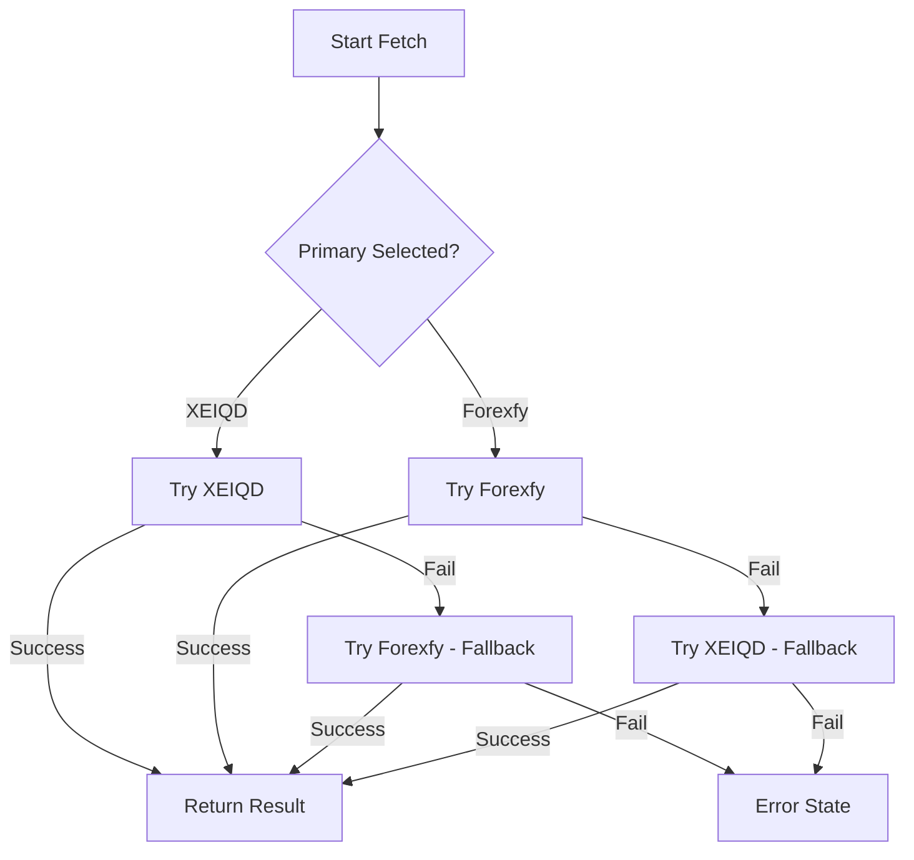

# Exchange Rate System

The ERP System includes a robust, client-side live exchange rate integration for converting between USD and IQD. This system is designed to be highly reliable by utilizing multiple data sources and a smart fallback mechanism.

## Overview

- **Purpose**: Fetch real-time USD to IQD market rates for accurate pricing and sales.
- **Architecture**: Pure client-side scraping with a Vite-based development proxy to bypass CORS.
- **Reliability**: Triple-source system (XEIQD, Forexfy, DolarDinar) with automatic fallback.
- **Persistence**: User preferences (Primary Source) are stored in `localStorage`.

## Data Sources

### 1. XEIQD (xeiqd.com)
- **Label**: `XEIQD USD/IQD (Slower & More Accurate)`
- **Nature**: Provides local Sulaymaniyah spot rates.
- **Scraping Logic**: 
    - Attempts to find the "Sulaymaniyah" specific rate in the HTML table using regex.
    - If specific location data is missing, it falls back to parsing a `cachedData` JSON snippet embedded in the page's scripts.
- **Transformation**: Values are converted to float, multiplied by 100, and rounded to the nearest integer.

### 2. Forexfy (forexfy.app)
- **Label**: `Forexfy USD/IQD (Faster & More Reliable)`
- **Nature**: Provides "Black Market" / Parallel Market rates.
- **Scraping Logic**:
    - Primary: Extracts data from a serialized `const rates` JSON object found in a script tag.
    - Secondary: Regex fallback for the "Sell Price" HTML structure (e.g., `Sell Price:</span> <b class="fs-5">1,453.95</b>`).
- **Transformation**: Extracted "Sell Price" is multiplied by 100.

## Implementation Details

### CORS Workaround (Vercel/Vite Proxy)
Since the app runs entirely in the browser and both sources lack CORS headers for public API access, the system includes proxy rules to route requests:

```typescript
// vite.config.ts / vercel.json
proxy: {
  '/api-xeiqd': {
    target: 'https://xeiqd.com',
    changeOrigin: true,
    rewrite: (path) => path.replace(/^\/api-xeiqd/, ''),
  },
  '/api-forexfy': {
    target: 'https://forexfy.app',
    changeOrigin: true,
    rewrite: (path) => path.replace(/^\/api-forexfy/, ''),
  }
}
```

### Fallback Logic
The system allows users to select a **Primary Source** in Settings. 
1. The app attempts to fetch from the **Primary Source**.
2. If the primary fetch fails (network error, parsing error, or CORS block), it automatically attempts a fetch from the **Secondary Source**.
3. If both fail, an error state is triggered in the UI.

### Logic Flow (`fetchUSDToIQDRate`)


## UI Components

### `ExchangeRateIndicator` (Sticky Top Bar)
- Displays current rate as `USD/IQD: 145,395`.
- Includes a **Pulsing Green Circle** to indicate "Live" status.
- **Refresh Time**: Shows the last successful sync time in `HH:MM` format.
- **Fallback Indicator**: If the system is currently using the fallback source, its name (e.g., `(Forexfy)`) is displayed to the right of the pulsing circle.
- **Manual Refresh**: A button to manually trigger a re-fetch.

### `Settings` (General Tab)
- **Primary Source Selection**: A dropdown to choose between XEIQD and Forexfy.
- **Instant Sync**: Changing the setting dispatches a custom `exchange-rate-refresh` event, which the `ExchangeRateIndicator` listens for to update immediately.

## Key Files
- `src/lib/exchangeRate.ts`: Core fetching and scraping logic.
- `src/ui/components/ExchangeRateIndicator.tsx`: UI component for the top bar.
- `src/ui/pages/Settings.tsx`: Configuration UI and event dispatching.
- `vite.config.ts`: Proxy configuration for development.
